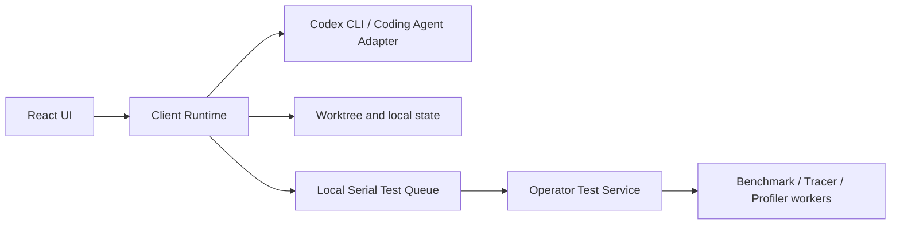

# Operator Studio

Operator Studio 是面向异构算子优化的本地 Agentic IDE。Agent 推理、工具调用、候选生成、代码工作区、流程状态、效果决策和知识维护都属于客户端；远端测试服务只接收算子测试任务并返回 Benchmark、Tracer 和 Profiler。

## 产品边界



- `src/`：产品界面，只展示客户端运行时返回的状态。
- `client-runtime/`：本地应用后端，负责 Agent Adapter、Mission、候选、工作区、决策、知识和本地持久化。
- `test-service/`：远端测试服务契约的 Mock 实现，不提供 Mission、Agent、候选、决策或知识 API。
- `tests/`：客户端运行时、产品边界、烟雾和发布守卫测试。
- `reference-fixture`：仅供自动化测试使用，不能作为展会运行模式。

## 启动

```powershell
npm install
npm run dev
```

开发模式同时启动 Web、客户端本地运行时和 Mock 测试服务：

- Web：`http://127.0.0.1:5173`
- Client Runtime：`http://127.0.0.1:4174`
- Operator Test Service：`http://127.0.0.1:4180`

构建后的本地产品：

```powershell
npm run build
npm start
```

默认页面地址为 `http://127.0.0.1:4173`。`npm start` 会同时启动客户端运行时和 Mock 测试服务。

## 连接 Codex Agent

默认模式是 `codex-cli`。客户端只探测 Codex 可执行文件，然后自动启动或恢复 Mission 对应的 thread，并读取 JSONL 运行事件；Provider、模型、base URL 和认证全部由用户本机 Codex 自己管理，Operator Studio 不读取或注入这些配置。

```powershell
codex --version
npm start
```

客户端通过 `codex exec --json` 启动新 thread；同一 Mission 再次运行时默认通过 `codex exec resume` 恢复历史 thread。`cli-file` 保留为旧算子迭代系统的兼容适配器，OpenCode 保留为实验适配器。

## 研究员子 Agent（research scout）

主优化线程之外，客户端可启动第二个 Codex 线程做**只读联网调研**：停滞升级或操作员触发时，研究员用开放沙箱检索论文/开源库，产出结构化调研笔记，经价值闸后注入下一轮优化目标。它绝不直接生成候选——候选准入仍由工作区 Git Diff 把关。

- 手动触发：Mission 视图"研究员"面板发起（留空方向=自动从卡点生成）；`POST /api/missions/:id/research`。
- 自动升级：停滞（连续 3 轮无采纳，串行等待）或死磕检测（同方向重复无进展失败，异步并行审查）。
- 预算与兜底：单轮/研究员时长预算；MAX_ROUNDS / 总时长 / 研究员升级次数上限命中后标记需人工。
- 真实联网验证：`npm run research:smoke`（需本机 codex 已登录 + 有网）。

```powershell
codex --version
npm run research:smoke
```

## 连接 OpenCode（实验模式）

OpenCode `1.1.25` 可以通过 Headless Server 作为本地 Agent Runtime：

```powershell
# 终端 1：使用 OpenCode 自己的认证和配置启动本地 API
npm run opencode:serve

# 终端 2：启动 Operator Studio
$env:OPERATOR_RUNTIME_MODE='opencode-server'
$env:OPENCODE_SERVER_URL='http://127.0.0.1:4096'
$env:OPENCODE_AGENT='plan'
$env:OPENCODE_MODEL='provider/model-id'
npm start
```

当前接入会创建 OpenCode Session、异步提交 Mission，并读取 Session Status、Message、Tool Part 和 Diff。`plan` Agent 用于只读分析；OpenCode 的 Patch 应用、权限响应和 Decision 回传尚未启用，因此该模式不能通过展会发布诊断。API key 由 OpenCode 自己管理，Operator Studio 不保存 Provider 密钥。

## 测试服务契约

客户端向测试服务提交 `POST /v1/operator-tests`，轮询 `GET /v1/operator-tests/{taskId}`，结果仅包含：

- Benchmark 测量值和正确性结果
- `operator-trace/v1` Tracer 工件
- `operator-profile/v1` Profiler 工件
- 环境、日志和执行时间

当前 `test-service/mock-server.mjs` 返回确定性 Mock 结果；替换真实服务时保持同一契约即可。

## 验证

```powershell
npm run test:runtime
npm run test:queue
npm run test:test-service
npm run test:boundary
npm run test:opencode
npm run test:codex
npm run test:smoke
npm run test:release
npm run test:research
npm run test:loop
npm run test:journal
npm run build
```

`test:boundary` 会验证测试服务不存在 Mission API，并验证默认未连接状态不会生成 Agent Run。`test:opencode` 使用本地 Mock OpenCode Server 验证 Session、Prompt、Message、Tool、Diff 和 Provider 错误投影。`test:research`/`test:loop`/`test:journal` 覆盖研究员 run 生命周期、循环策略（停滞/死磕/预算/兜底/同步异步）与耐久命令日志。

## 数据与接口

- 本地状态：`data/mock-db.json`（文件名是历史遗留，数据归客户端所有）
- 本地工作区：`runtime/`
- 客户端健康检查：`GET /api/health`
- Agent Runtime：`GET /api/runtime`
- 客户端状态：`GET /api/state`
- 测试服务健康检查：`GET http://127.0.0.1:4180/health`

`data/` 和 `runtime/` 是运行时目录，不应提交为源代码。更完整的架构、模块和契约见 `for_programmer/`。
