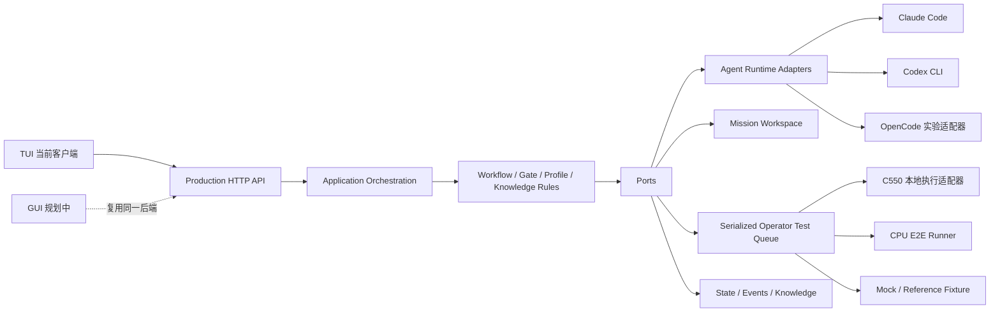

# Operator Studio

Operator Studio 是面向异构算子优化的本地 Agent 工作台。当前生产客户端是 TUI；后续 GUI
将复用同一个 HTTP API、应用编排、工作区、测试队列、Gate 和经验库，不再建立第二套流程。

- 当前主分支：`main`
- 生产入口：`npm run tester:c500`
- 目标真机：沐曦 C550（`c500`、`local-c500` 仅作为保留的程序兼容标识）

## 当前状态

- TUI 已接入生产 HTTP API，不直接修改持久化状态。
- Claude Code 是 TUI 默认 Agent Runtime；Codex CLI 可显式选择。
- Candidate 只允许写入当前 Mission Workspace，并由 Git Diff 和摘要准入。
- Baseline 与 Candidate 通过串行 Operator Test Queue 执行 Correctness 和 Benchmark。
- Accept Gate 自动决定采用、保留参考、拒绝或进入人工处理。
- 未达到目标的已结算轮次会自动回滚并开始下一轮，不需要用户逐轮点击继续。
- 经验查询、草稿生成和经验沉淀已进入生产 workflow；仿真证据不能发布为真机经验。
- CPU 端到端测试会真实执行轻量算子，用于验证无 C550 环境下的完整迭代闭环。

### 硬件命名约束

- `C550` 是当前唯一的沐曦生产目标。新建 Mission 的 `hardware`、测试矩阵的
  `environments`、模拟后端的 `device` 以及新生成的执行证据必须使用 `C550`。
- `tester:c500`、`local-c500`、`LOCAL_C500_*`、`OPERATOR_LOCAL_C500_*` 和
  `LOCAL_C500_*` 错误码是稳定的兼容接口，暂不重命名；其中的 `c500` 不表示任务会在
  C500 上执行。
- C500 与 C550 是不同设备，Runner 匹配时不会视为同一后端。旧状态或历史证据中真实的
  `C500` 标签必须原样保留，也不能用于通过 C550 发布门禁。

## 系统边界



依赖方向固定为：

```text
TUI / future GUI
  -> HTTP API
  -> application orchestration
  -> domain rules
  -> ports
  -> adapters
```

Domain 不得依赖 TUI、HTTP、Claude、Codex、C550 或文件系统实现。HTTP Route 不得复制
workflow、Gate、Profile 或硬件规则。

## 生产 Workflow

```text
创建/选择 Project
-> 创建 Mission 并冻结目标、shape、dtype、指标和测试矩阵
-> 解析或生成 Baseline
-> 在同一执行后端实测 Baseline
-> 查询与当前任务相关的经验
-> Agent 在隔离 Mission Workspace 生成 Candidate
-> Git Diff、文件范围和 Candidate 摘要准入
-> 串行提交 Correctness
-> Correctness 通过后执行 Benchmark
-> Accept Gate 对比 Baseline、目标和证据来源
   -> 达标：采用 Candidate -> 更新仓库 -> 生成经验草稿 -> 经验治理
   -> 未达标：保留弱候选证据或生成失败记录 -> 恢复稳定工作区 -> 自动进入下一轮
   -> 基础设施或契约失败：按统一错误契约重试、停止或请求人工处理
```

Baseline oracle 会独立持久化。Candidate 测试必须使用该 oracle 的 correctness cases 和
benchmark profiles，不能用 Candidate 自己提供的 `reference()` 或输入替换验收标准。

## 经验生命周期

经验不是 Agent 的自由文本缓存，而是受 evidence 和 Gate 约束的资产：

1. **查询经验**：目标解析、瓶颈诊断和 Candidate 生成前，按算子、Profile、硬件、shape、
   dtype、历史失败与已尝试方向查询。
2. **生成草稿或失败记录**：通过候选准入和证据条件的结果，根据 Candidate Diff、测试证据、
   环境指纹和 Gate 结论生成经验草稿；硬门禁失败生成 Failure Record，并提取负向经验边界。
   弱候选只保留为参考，不要求每份证据都转成知识草稿。
3. **沉淀经验**：只有来源、语义绑定、Candidate 摘要和证据等级满足治理规则的草稿才可进入
   正式经验库；需要审核的保留为草稿，重复项合并，低价值项不发布。
4. **证据隔离**：`simulation` 和 `cpu-e2e` 只验证流程，永远不能升级为可发布的 C550
   `liveHardware` 经验。

## 快速启动

### C550 生产 TUI

目标机先完成所选 Agent 的登录，然后运行：

```bash
npm ci
npm run tester:c500
```

Linux C550 目标机推荐使用统一入口：

```bash
bash scripts/c500-test.sh verify
bash scripts/c500-test.sh doctor
bash scripts/c500-test.sh start
```

默认 Agent 是 Claude Code。显式切换到 Codex：

```bash
export OPERATOR_RUNTIME_MODE=codex-cli
npm run tester:c500
```

详细部署、环境检查、端口和 TUI 操作见
[`tools/local-c500-tester/README.md`](tools/local-c500-tester/README.md)。

### 无硬件体验

完整界面与状态机仿真，不调用模型、Python 或硬件：

```bash
npm run tester:c500:simulation
```

仿真结果始终是 `liveHardware=false`，不得作为 C550 验收证据。

### Web 开发客户端

`src/` 中现有 Web 界面是开发客户端，不是当前生产操作入口：

```powershell
npm install
npm run dev
```

- Web：`http://127.0.0.1:5173`
- Client Runtime：`http://127.0.0.1:4174`
- Mock Test Service：`http://127.0.0.1:4180`

后续 GUI 应继续调用 Production HTTP API，不得直接读取状态文件或复制 workflow。

## Agent Runtime

| Runtime | 状态 | 用途与限制 |
|---|---|---|
| `claude-code` | 生产可用，TUI 默认 | Candidate、Research、Baseline Materializer、结构化事件和取消 |
| `codex-cli` | 生产可用，可选 | 复用本机 Codex 配置，通过 JSONL 投影运行过程 |
| `opencode-server` | 实验 | 当前缺少完整 Patch/Decision 动作桥，不满足生产验收 |
| `cli-file` | 兼容 | 只保留已验证的旧文件协议边界，不是新功能扩展目标 |
| `reference-fixture` | 仅测试 | 生成确定性参考数据，不能产生可发布证据 |

Operator Studio 不保存或注入 Agent Provider 的 API key、模型地址和登录凭据。认证与模型配置
由对应的本机 Agent CLI 管理。

## 执行后端

| 后端 | 是否真实执行 | Evidence | 用途 |
|---|---:|---|---|
| C550 local runner | 是 | `liveHardware=true` | 生产 Correctness、Benchmark 和发布验收 |
| CPU E2E runner | 是 | `source=cpu-e2e`, `liveHardware=false` | 开发机端到端流程验证 |
| Hardware Mock | 否 | `liveHardware=false` | 真实 Agent + 可重复多轮工作流测试 |
| Full Simulation | 否 | `liveHardware=false` | TUI/API/状态机快速检查 |
| `test-service` Mock/remote adapter | 兼容路径 | 取决于适配器返回 | 旧 HTTP 测试服务契约与远端联调 |

当前 Queue 仍直接使用具体执行适配器。统一的本地/远端执行工具、内容寻址执行包、依赖预检、
后端能力查询和统一错误返回仍是待实现项，目标契约记录在
[`client-runtime/README.md`](client-runtime/README.md#todo通用测试执行工具)。

## 核心模块

| 目录 | 职责 |
|---|---|
| `tools/local-c500-tester/` | Ink TUI、Production API Client、启动器和 C550 环境预检 |
| `client-runtime/server/` | HTTP、SSE 和静态资源的薄适配层 |
| `client-runtime/application/` | 与传输无关的用例编排 |
| `client-runtime/` | Workflow、Agent、Workspace、Queue、Gate、Knowledge 和持久化边界 |
| `test-service/` | 旧 HTTP Operator Test Service 契约的 Mock/remote compatibility adapter |
| `test-fixtures/` | Reference Fixture 使用的隔离样例，不是产品数据源 |
| `src/` | Web 开发客户端；未来 GUI 可复用 Production API |
| `tests/` | 单元、契约、集成、鲁棒性和端到端测试 |
| `docs/development/` | 当前架构图、团队讲稿和开发约束 |

每个模块目录的 README 定义模块功能、输入、输出、不变量、副作用和公开接口。修改契约时必须
同步更新对应 README。

## 不可破坏的约束

- `client-runtime/fixed-operator-profiles.mjs` 是固定 Profile 和测试矩阵的唯一语义来源。
- Simulation evidence 不能变成可发布的真机 evidence。
- Candidate evidence 必须匹配实际应用到 Mission Workspace 的 Candidate。
- 固定 shape、dtype、correctness cases、benchmark profiles 和重试预算不得弱化。
- Agent 写入范围仅限当前 Mission Workspace。
- Operator tests 必须串行执行并原子持久化终态。
- 生产行为只能走客户端 -> Production API -> Client Runtime，不得建立第二套 workflow。
- 外部失败必须通过统一错误契约归一化。

## 数据目录

普通 Client Runtime 默认写入：

```text
.operator-studio-local/
  data/mock-db.json
  runtime/
```

C550 TUI 默认写入：

```text
.local-c500-production/
  data/
  runtime/
  local-c500-tasks/
```

可通过 `OPERATOR_STORAGE_ROOT`、`OPERATOR_DATA_DIR`、`OPERATOR_RUNTIME_DIR` 或
`LOCAL_C500_TESTER_HOME` 覆盖。运行时目录不应提交到 Git。

## 验证

跨模块修改必须运行：

```bash
npm run verify:local-c500-release
```

无硬件改动还应运行：

```bash
npm run verify:non-hardware-robustness
```

CPU 流程测试：

```bash
npm run e2e:cpu-iteration        # Reference Fixture + 实际 CPU 执行
npm run e2e:cpu-agent-iteration  # 真实 Agent + 实际 CPU 执行，手动验收
```

真实 Agent E2E 默认使用已登录的 Claude Code；通过
`E2E_AGENT_RUNTIME=codex-cli` 可选择 Codex。该测试会消耗真实 Agent 会话，因此不加入日常
验证套件。

## 开发文档

- [开发架构与依赖方向](docs/development/ARCHITECTURE.md)
- [Client Runtime 模块契约](client-runtime/README.md)
- [Application 编排模块契约](client-runtime/application/README.md)
- [Server 传输模块契约](client-runtime/server/README.md)
- [C550 TUI 模块契约](tools/local-c500-tester/README.md)
- [测试模块契约](tests/README.md)
- [当前模块与 Workflow 可视化](docs/development/operator-studio-module-workflow.html)
- [15 分钟团队讲稿](docs/development/operator-studio-team-briefing-15min.md)
