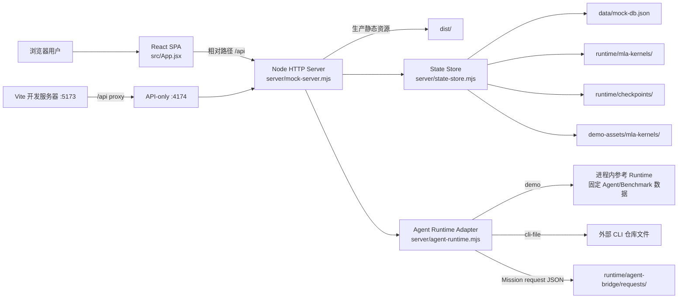
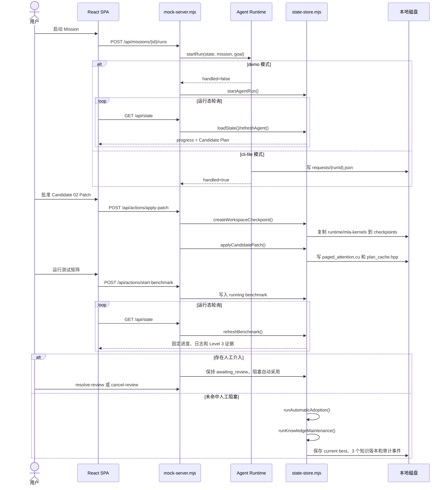
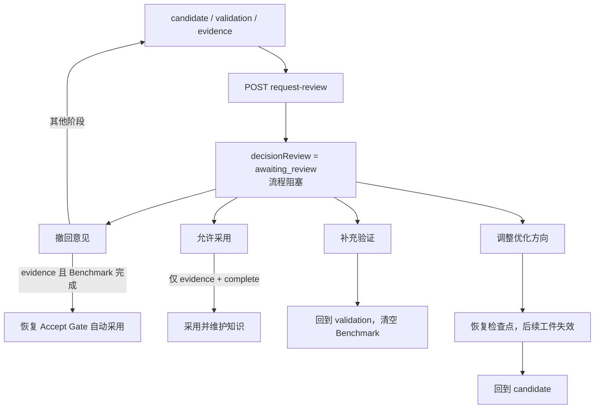

# Operator Studio 架构

## 1. 系统边界

Operator Studio 当前是本机优先的单仓库应用：浏览器负责交互，Node 服务同时提供静态资源和 JSON API，状态与工作区落在本地磁盘。所谓 Runtime 有两种模式：默认 `demo` 模式在服务进程内生成参考流程；`cli-file` 模式通过文件读取外部 CLI 状态，并只写出 Mission 请求。



## 2. 部署形态

| 形态 | 入口 | Web | API | 数据位置 |
| --- | --- | --- | --- | --- |
| 开发 | `npm run dev` | Vite `:5173` | Node `:4174`，`SERVE_WEB=false` | 仓库 `data/`、`runtime/` |
| 展会源码运行 | `npm run build` + `npm start` | Node `:4173` | 同源 `:4173/api` | 仓库 `data/`、`runtime/` |
| 离线展会包 | `启动展会版.cmd` | 内置 Node `:4173` | 同源 `:4173/api` | `%LOCALAPPDATA%\OperatorStudioExhibition` |
| CLI 文件投影 | 设置 `OPERATOR_RUNTIME_MODE=cli-file` 后启动 | 同上 | 同上 | UI 状态仍在本地；CLI 权威文件在 `OPERATOR_CLI_ROOT` |

## 3. 前端数据流

`src/main.jsx` 只负责挂载 `App`。`App.jsx` 是当前唯一业务前端模块，内部包含页面、抽屉、对话框、请求封装和状态映射：

1. 首次挂载并行请求 `/api/state` 与 `/api/workspace`。
2. 后端返回的 `state` 被映射到 React 本地 state。
3. 当 Agent 或 Benchmark 处于运行态时，每 420ms 请求 `/api/state`。
4. 用户动作通过 `/api/missions/*`、`/api/actions/*`、`/api/knowledge/*` 修改服务端状态。
5. 修改成功后，响应中的完整 `state` 再次覆盖前端状态。
6. 测试矩阵、工作区、通知数和暂停状态通过 `PATCH /api/state` 持久化。

前端没有独立数据层、路由库或全局状态库；视图切换和所有领域状态均集中在 `App.jsx`。

## 4. 状态与持久化

`server/state-store.mjs` 是领域状态中心：

- `createSeedState()` 生成 schemaVersion 4 的演示数据。
- `ensureStorage()` 创建数据目录，并从 `demo-assets/mla-kernels` 初始化工作区。
- `loadState()` 做 schema 迁移、Demo Runtime 时间推进、自动采用和知识维护。
- `saveState()` 先写临时文件，再 `rename` 到 `mock-db.json`。
- `projectActiveMission()` 把顶层活动状态投影回当前 Mission。

注意：`GET /api/state` 在 Demo Runtime 中可能推进 Agent、Benchmark、自动采用和知识维护，因此它不是严格无副作用的查询。

## 5. 关键请求链路

以下链路是本次 Smoke 测试实际覆盖的主流程：



## 6. 人工介入与恢复链路



## 7. Runtime 权威边界

### Demo 模式

- Patch 文件和检查点是真实本地 I/O。
- 状态、审计和知识版本是真实本地持久化。
- Agent 推进、工具调用摘要、Benchmark 日志、C500/CUDA 数值和 Accept Gate 证据是固定参考数据。
- `/api/runtime` 明确返回 `liveHardware=false`、`authority=operator-studio-reference`。

### CLI 文件模式

- 读取 `results/agent_status_cli_integration.json`、`results/test_queue.jsonl`、`docs/optimization_records.json` 判断连接状态。
- Mission Run 写入 `requests/{runId}.json`。
- 只将 CLI 状态和事件投影到 UI Agent 状态。
- Patch、Benchmark、Decision、Review、Rollback、Reset 均未桥接，相关动作返回 `RUNTIME_ACTION_UNAVAILABLE`，防止生成伪造的 Demo 结果。

## 8. 主要依赖方向

```text
src/main.jsx -> src/App.jsx -> fetch /api
vite.config.js -> React plugin + /api proxy
server/dev.mjs -> server/mock-server.mjs + Vite
server/mock-server.mjs -> server/state-store.mjs -> filesystem
server/mock-server.mjs -> server/agent-runtime.mjs -> filesystem/CLI projection
server/*-test.mjs -> HTTP server or runtime adapter -> isolated temp/runtime directories
scripts/*.ps1 -> npm scripts + dist/server/demo-assets -> release package
```

模块级职责和测试映射见 [MODULE_MAP.md](./MODULE_MAP.md)，HTTP 合约见 [API_CONTRACTS.md](./API_CONTRACTS.md)。
