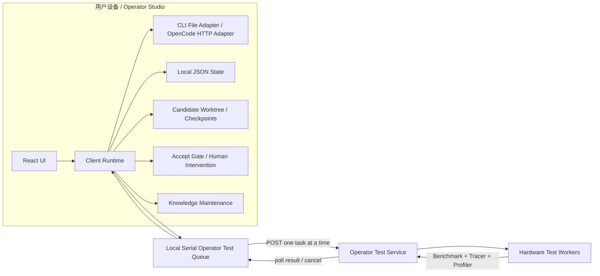
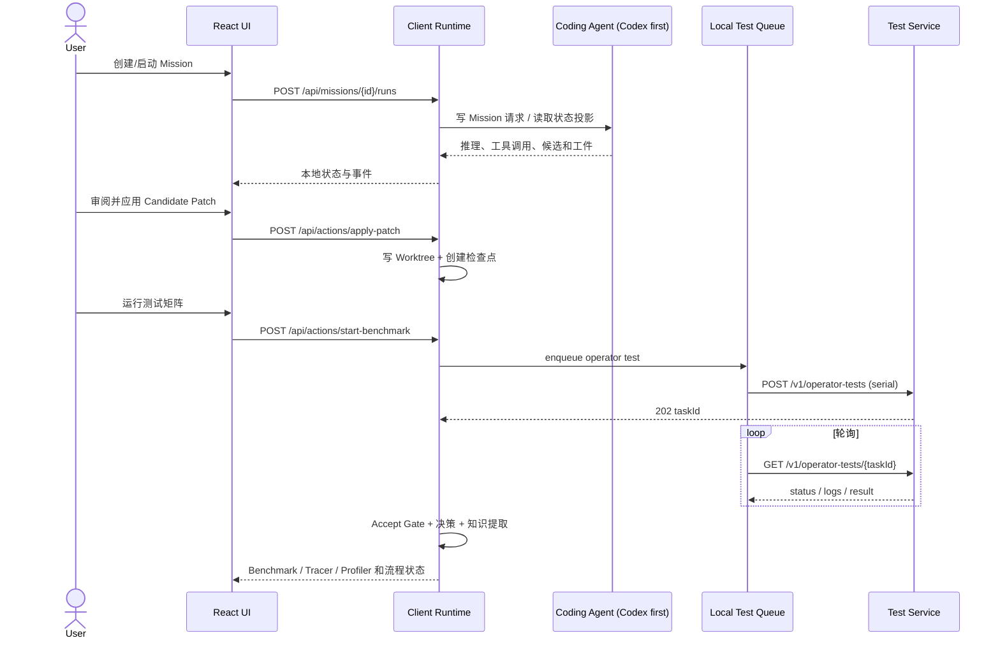

# Architecture

The client owns Agent reasoning, tool calls, candidate generation, Gate, knowledge, iteration history, and the serial operator-test queue. The remote boundary is deliberately narrow: submit an operator test task and read benchmark/tracer/profiler results.

## 1. 边界

Operator Studio 是本地 Agentic IDE，不是由服务端编排 Agent 的 Web SaaS。远端唯一职责是执行算子测试任务并返回 Benchmark、Tracer、Profiler。当前远端实现为 Mock，但接口边界按真实服务设计。

不允许在 Test Service 中出现 Mission、Agent Run、推理、工具调用、候选、决策、知识或 current best API。

## 2. 关键请求链路

## 3. 运行模式

| 模式 | 用途 | 是否可用于生产流程 |
| --- | --- | --- |
| `codex-cli` | 默认模式；自动探测本机 Codex 登录并以 JSONL 投影运行事件 | 是，需本机完成 Codex 登录 |
| `unavailable` | 显式禁用 Agent；不生成 Agent 数据 | 否 |
| `cli-file` | 对接已验证 CLI 的文件协议 | 是，但当前动作桥未完成 |
| `opencode-server` | 对接 OpenCode Headless Server；投影 Session、Message、Tool、Diff | 否，当前为实验模式 |
| `reference-fixture` | 自动化测试夹具 | 否 |

## 4. 持久化

- `data/mock-db.json`：客户端本地 JSON 状态。文件名为历史遗留，不代表远端数据库。
- `runtime/`：候选工作区、检查点、Agent Bridge 请求和日志。
- Test Service Mock：任务只保存在服务进程内存中，进程退出后清空。

## 5. 信任和权威

- Agent 推理与候选权威：默认是客户端自动启动或恢复的 Codex thread；`cli-file` 和 OpenCode 是兼容/实验适配器。
- 工作区和流程权威：Client Runtime 本地状态与文件系统。
- 测试证据权威：Operator Test Service 返回的结构化结果；Mock 结果必须标记 `liveHardware=false`。
- current best 和知识版本：Client Runtime 根据证据与策略维护，Test Service 无权修改。
